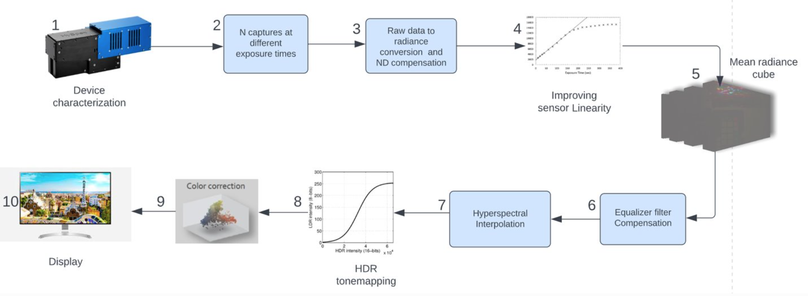

# An Efficient High Dynamic Hyperspectral Imaging Pipeline

It is a challenging task to retrieve the details in hyperspectral images having both dark areas and bright areas. It is due to the arbitrary illumination and imaging equipment constraints, such as limited dynamic range and non-linear sensor response. To address this issue, high dynamic range techniques can be applied allowing to significantly recover the details of the scene. In this study, an efficient high dynamic hyperspectral imaging (HDHI) pipeline is proposed which involves data acquisition, hyperspectral image processing and an improved tone mapping for LDR display. To the best of our knowledge, this is the first attempt that aims to improve the HDHI by retrieving the radiances beyond the sensor linearity and applying spectral interpolation. 

Additionally, the evaluation of the most promising tone mapping operators for the hyperspectral imaging is performed while an improved tone mapping workflow is introduced
 
## Experiemental setup
The Hyspex VNIR 1800 hyperspectral camera along with spectral flattening (SF) and neutral density (ND) filters have been used for data acquisition. The scene consists of a purse of sequins and a colorchecker passport, both put on an eye checker board. The scene has about half the area directly exposed to a mixture of light sources (halogen and fluorescent), whereas the other half of the scene is exposed to a dim light source (flourescent) only.

##Methodology
For validating the sensor linearity, several captures of a uniformly illuminated white tile were taken with Hyspex VNIR 1800 which revealed the limit of sensor linearity to 45,000 digital counts. To recover the radiance values, corresponding to digital counts beyond this threshold, we applied linear regression so we can get valid raw data upto 63,000 digital counts. Due to high speckles in the scene, a black reflectory surface was used to reduce pixel saturation at higher integration times. Among these 18 captures, one shot was taken using an ND filter. This was done so that the radiances saturating the sensors even at the minimum integration time, could have valid measurements. Moreover, SF filter was used throughout the data acquisition to prevent sensor blooming and glaring effects. Finally mean radiance cube was calculated using 18 hyperspectral radiance cubes which were compensated to remove the effect of filters used during data acquisition. Later, spectral interpolation was performed to cater for the missing wavelengths in mean radiance cube where the sensor was saturated across all the integration settings. Several tone mapping operators (TMOs) were evaluated and an improved tone mapping workflow has been introduced using segmented tone mapping [2][3]. Luminance map has been used to segment the scene into three regions (i.e. bright, dark, and transitory). Transitory region was used to merge the bright and dark areas by euclidean distance as a weighting function, which helped to reduce artifacts. Additionally, the variation in pixel intensity of HDR images resembles to the histogram of hazy images[4][6]. Thus, dehazing has potentially improved the overall result. We applied dehazing, TMOs, and color correction before gamma encoding so they operated in linear domain [5].

##Poster
[CVCS_POSTER_final (3).pdf](https://github.com/AqsaHassan/cosi-High-dynamic-hyperspectral-imaging/files/10767908/CVCS_POSTER_final.3.pdf)
